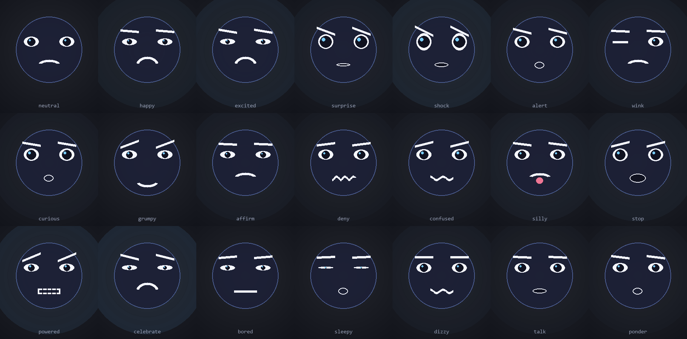

# Avatar Interactivo · Laboratorio de Informatica

Avatar 2D que reacciona a la cara y a las manos de quien pasa por el laboratorio.
Se ejecuta en la pantalla secundaria del AIO, sigue la mirada con la camara USB
y responde a gestos con sonidos. Todo el procesamiento es local y en vivo: no se
graba ni se guarda imagen ni audio.



## Como funciona

```
camara USB  ->  MediaPipe (Tasks API)  ->  metricas de cara/manos
                                            |
                              GestureEngine (cooldown + histeresis)
                                            |
                       +--------------------+--------------------+
                       |                                         |
              Avatar 2D (pygame)                    SoundEngine
              pantalla secundaria                  assets/sounds (CC0)
                                                       -> fallback sintetizado
```

## Requisitos

- Windows 10/11 (el AIO), Python 3.10 - 3.14
- Dos monitores (el segundo es donde aparece el avatar)
- Camara USB (se prioriza sobre la interna)
- Altavoces del AIO para los sonidos

## Instalacion

### Opcion A: clonar del repositorio (otra maquina)

```bash
git clone https://github.com/LuisFloresA/ViewEmoji.git
cd ViewEmoji
scripts\install.bat
```

`install.bat` deja todo listo: crea el entorno virtual, instala las
dependencias, **arregla el conflicto de OpenCV** y descarga los modelos de
deteccion (~11 MB). Tarda unos minutos la primera vez y **necesita internet**.

Despues, para arrancar:

```bash
scripts\run.bat
```

Y ya esta. `run.bat` comprueba que el entorno este listo y, si falta, se
instala solo antes de arrancar.

### Opcion B: copiar la carpeta

Si prefieres no usar Git, copia el proyecto **sin la carpeta `venv/`** (no es
portable: guarda rutas absolutas de esta maquina) y ejecuta
`scripts\install.bat` en la nueva. Son unos 12 MB.

### Instalacion manual (si prefieres no usar los .bat)

```bash
python -m venv venv
venv\Scripts\python.exe -m pip install -r requirements.txt
venv\Scripts\python.exe scripts\download_models.py
venv\Scripts\python.exe scripts\check_env.py
venv\Scripts\python.exe scripts\smoke_test.py
```

Atajo: `scripts\run.bat` hace todo lo anterior en una sola ejecucion.

### Requisitos

- **Python 3.10 a 3.14.** Por encima no hay ruedas de `pygame-ce` ni de
  `mediapipe`, y `bootstrap.py` lo avisa en vez de dejar un fallo raro.
- Windows 10/11. La instalacion y el arranque estan probados en Windows; el
  resto del codigo es portable.
- En el AIO hacen falta **dos monitores** (el avatar va en el segundo) y una
  **camara USB**.

## Ejecucion

```bash
# preparacion del entorno (venv + dependencias + modelos)
venv\Scripts\python.exe scripts\bootstrap.py

# ejecucion
venv\Scripts\python.exe src\main.py
```

| Tecla | Accion |
|---|---|
| `ESC` / `Q` | Salir |
| `D` | Vista previa de la camara (ajuste de encuadre) |
| `S` | Landmarks y metricas en pantalla |

## Camara: se elige por nombre, no a ciegas

La app **no** abre todas las camaras para buscarlas (eso hacia parpadear los
LED de los dos sensores y dejaba la USB en mal estado). En su lugar consulta
DirectShow los nombres de dispositivo, elige el externo y solo abre ese.

En tu equipo la seleccion queda asi:

```
indice 0: 'Integrated Camera'    (internal)   <- no se abre
indice 1: 'ViewSonic HD webcam'  (usb)        <- se abre
```

Claves en `config/config.yaml`:

```yaml
camera:
  prefer_usb: true      # elegir la externa antes que la integrada
  device_index: -1      # -1 = autodetectar por nombre
  device_name: ""       # texto a buscar (p.ej. "ViewSonic") si el auto falla
```

Si el nombre de tu camara USB cambia, ponlo en `device_name` o fija
`device_index`. `scripts\test_camera.py` prueba la logica de seleccion sin
tocar ningun dispositivo.

```
src/
  main.py       bucle principal: camara -> deteccion -> render + audio
  camera.py     seleccion de camara por nombre (prioriza USB)
  gestures.py   MediaPipe Tasks API + motor de gestos con cooldown
  avatar.py     avatar 2D por primitivas (ojos, pupilas, cejas, boca)
  audio.py      reproduccion con prioridad CC0 y fallback sintetizado
  config.py     carga de YAML con valores por defecto

config/
  config.yaml       camara, pantalla, avatar, umbrales, audio
  gestures.yaml     tabla de gestos -> reaccion + sonido (fuente de verdad)

scripts/
  install.bat                prepara el entorno: venv + deps + modelos
  bootstrap.py               la logica de instalacion (Python, no batch)
  check_env.py             diagnostico de dependencias, monitores y camaras
  test_camera.py           pruebas de seleccion de camara (no abre nada)
  smoke_test.py            pruebas sin hardware (render, gestos, idle, audio)
  gaze_probe.py            mide la mirada en vivo con la camara real
  calibrate_gaze.py        compara formulas de gaze sobre landmarks crudos
  make_expr_sheet.py       genera docs/img/expresiones.png
  download_models.py       descarga los .task de MediaPipe
  generate_fallback_sounds.py  genera los tonos de respaldo
  update_check.py          polling de actualizaciones por git
  run.bat                  arranque comodo (instala solo si falta)

docs/
  GESTOS_SONIDOS.md   tabla gestos / reacciones / sonidos / terminos CC0

assets/
  sounds/           sonidos CC0 que tu descargas (opcional)
  sounds_fallback/  tonos sintetizados (se generan solos)
```

## Gestos

16 gestos cubren boca abierta (con tres bandas: sorpresa, "aaah" tonto y
shock), sonrisa, cejas, guiño, inclinacion, asentir, negar, pulgar arriba,
palma, victory, puño, dos manos y la sacudida rapida. La tabla completa con
sonido, prioridad y termino de busqueda esta en
[docs/GESTOS_SONIDOS.md](docs/GESTOS_SONIDOS.md).

Cada gesto es de **disparo por flanco**: suena una vez al adoptar la postura y
no se repite mientras te la quedas. Se rearma al soltar, asi que un alumno
puede repetir el gesto cuando quiera sin que suene en bucle.

Si dos gestos salen en el mismo frame gana el de mayor `priority`, y si ya hay
una expresion de igual o mayor prioridad en curso el gesto se descarta entero:
la cara no cambia y el sonido tampoco suena. Asi lo que ves y lo que oyes
coinciden siempre.

## La cara y la mirada

El tamaño es un **porcentaje de la altura de la pantalla**, no pixeles, para
que se vea igual en un portatil de 720p que en el AIO a pantalla completa:

```yaml
avatar:
  size_ratio: 0.70   # 70% de la altura (a 1080p son unos 507 px de cara)
```

La mirada combina la **posicion de tu cara** (peso `gaze_w_pos`) con la
**direccion real de tu mirada** (desplazamiento del iris) y la **velocidad**
de tu cabeza. Como MediaPipe no da un "mirar al frente" absoluto, la app
aprende sola tu postura neutra; asi funciona con distintas personas y
distancias sin recalibrar. Para medirlo:

```
venv\Scripts\python.exe scripts\gaze_probe.py 20
```

## Acciones idle

Cuando no hay nadie delante, el avatar elige al azar entre una lista de
acciones con su propia expresion y movimiento de pupilas (mirar alrededor,
pensar, bailar, dormir, marearse, hablar, estirarse...) en vez de quedarse
congelado. Se ajusta con `avatar.idle_enabled` e `idle_min_gap` /
`idle_max_gap`. La lista esta en `IDLE_ACTIONS`, en `src/avatar.py`.

## Sonidos

La app funciona sin descargar nada: si falta un archivo usa un tono
sintetizado. Para usar sonidos reales, baja efectos CC0 de Pixabay o Mixkit y
dejalos en `assets/sounds/` con el nombre indicado en la tabla.

## Actualizaciones

```bash
venv\Scripts\python.exe scripts\update_check.py --once     # una comprobacion
venv\Scripts\python.exe scripts\update_check.py            # bucle cada 10 min
venv\Scripts\python.exe scripts\update_check.py --install  # tarea de Windows
```

`--install` crea la tarea programada `AvatarInterativoUpdate` que se ejecuta al
iniciar sesion. Si el remoto trae commits, hace `git reset --hard` y reinicia la
app. No hace falta Portainer: el proceso vive en el AIO y la supervision es local.

Para autoarranque del avatar al encender el AIO, crea otra tarea en el
Programador de tareas de Windows que lance `scripts\run.bat` al iniciar sesion.

## Notas del entorno

- Se usa `pygame-ce` porque no hay rueda de `pygame` para Python 3.14.
- `pygrabber` es necesario para elegir la camara USB por nombre. Sin el, la
  app avisa y cae al indice de `config.yaml` en vez de adivinar.
- `opencv-python` se fija en 4.10.x: las versiones 5.x y las headless 4.12+
  fallan en equipos con Smart App Control activo. Con esa version, numpy 2.x
  funciona con normalidad.
- Ojo con el conflicto de OpenCV: `mediapipe` depende de
  `opencv-contrib-python` (5.x) y este proyecto fija `opencv-python` 4.10, y
  las dos escriben en el mismo modulo `cv2`. Si tras instalar te aparece como
  5.x, reinstala a mano la buena:
  `pip install --force-reinstall --no-deps opencv-python==4.10.0.84`.
  `scripts\check_env.py` avisa si lo detecta.
- Los umbrales por defecto se calibraron para una webcam a 1-2 m. Ajusta
  `config/config.yaml` segun la distancia real de los estudiantes.
- Sin modo de grabacion: solo se procesa el fotograma en memoria.
